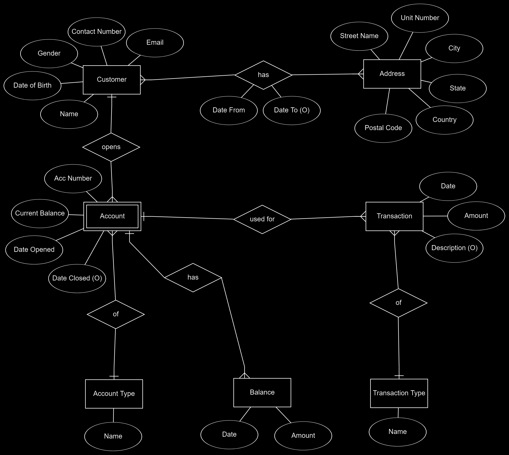
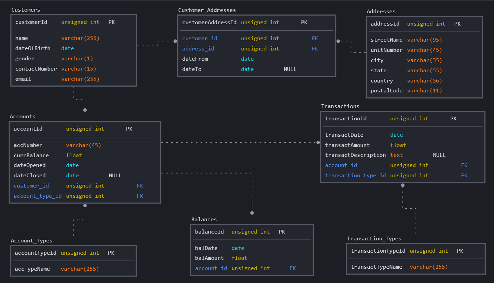
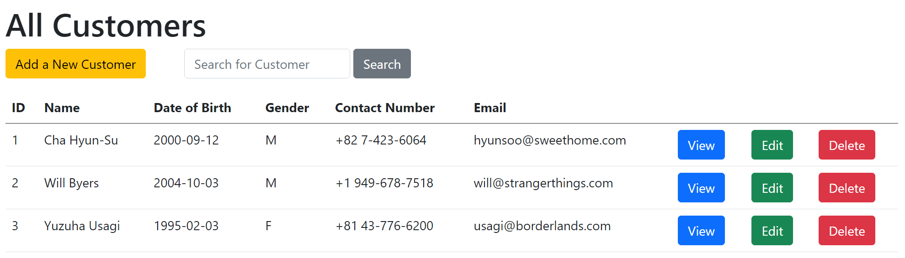
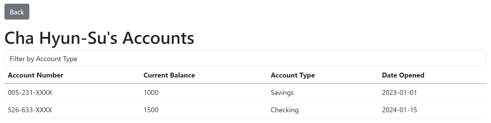
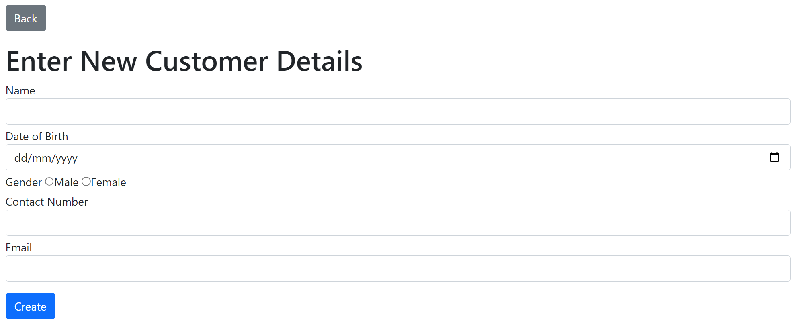
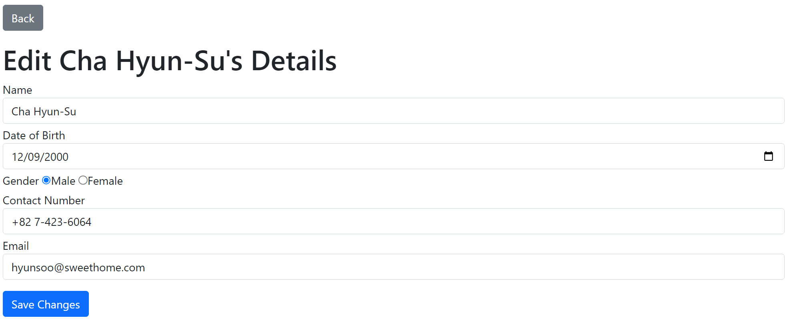
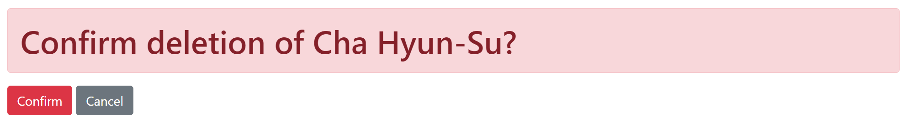

# Online Banking System Database
This project was built as a means to learn ExpressJS, handlebars, in conjunction with MySQL (26 March 2023)

## Overview
This simple application acts as a online banking system, allowing users to view a list of customers and their accounts. ~~In addition, the transactions, current and past balances can also be viewed for each account associated with a customer.~~ Users will be able to perform CRUD (Create, Read, Update, Delete) operations on the list of customers using a set of endpoints. The application was built using the ExpressJS framework, with handlebars, and utilises a MySQL Database for database interactions.

Here is the entity relationship diagram (ERD) of the online banking system:


In addition to the ERD, the following schema diagram was also drafted:


## Business Needs
`Customers` are able to open multiple `accounts` with a bank. Upon successful login to the system, they will be shown a list of `accounts` that they have with the bank. 

After selecting the desired account, they will be taken to a page showing the present and past `balances` in that particular account number. They will be able to request details of the last 'n' number of `transactions` they have performed. A report may also be generated containing their `transactions`. 

In addition, customers can also make fund transfer to any other account *in the same bank*. They could request for a cheque book, change of `address` or stop payment of cheques. They could also view their monthly and/or annual statements, as well as print out the statements.

### Assumptions Made
* The accounts are for **individual** customers (ie. not joint accounts between multiple customers)
* This is a **private** online banking system (ie. caters to individuals, not other customers such as organisations)

### Main Entity of Focus
1. Accounts
2. Addresses
3. Customers (Strong)
4. Transactions
5. Balances

## Configuration and Environment Variables
Before running the application, ensure that the following are setup in a .env file. Please refer to the `.env.sample file` for the variables required.
1. **MySQL Host**: This is the IP Address, or web domain name that will be used to host the database. An example of a valid IP Address is `127.0.0.1`.
2. **MySQL Username**: This is the username used to access the database.
3. **MySQL Database**: This is the name of the database the application will retrieve data from. The database name has been provided as `online_banking`.
4. **MySQL Password**: This is the password associated with the username. 

## Running the Application
To run the online banking application,
1. Change to the 'online-banking' directory
```
cd online-banking/
```
2. Install the required packages from NodeJS (Express, HBS, Wax-On, DotEnv, MySql2, Handlebars Helpers) in the directory
```
npm install
```
3. Install node monitor 
```
npm install -g nodemon
```
4. Start the server to run the application
```
nodemon
```

## Loading the sample SQL schema and data
Initiate MySQL using the the following command in the a new terminal (separate from the terminal running the server)
```
mysql -u <Insert Username>
```
Copy paste all the data in the files, in the following sequence, in the folder `sql`
1. schema.sql
2. data.sql

## Endpoints
The following endpoints are used to perform the CRUD operations.

### Customers
* `GET /customers`: Retrieve information of all customers
* `POST /customers`: Retrieve information of selected (searched) customers and display them in a new page
* `GET /create-customers`: Display the create new customer page
* `POST /create-customers` Create a new customer
* `GET /delete-customers/{customerId}`: Display the confirm delete a specific customer page
* `POST /delete-customers/{customerId}`: Deletes an existing customer *(Note: The program is currently unable to delete a customer with foreign key - eg. the 3 sample customers)*
* `GET /update-customers/{customerId}`: Displays the update existing customer page
* `POST /update-customers/{customerId}`: Updates an existing customer's information in the Customer table

### Accounts
* `GET /accounts/{customerId}`: Retrieve information of all the accounts of the customer specified using the customerId
* `POST/accounts/{customerId}`: Filter the accounts of the specified customer by account types

## Example Usage
Here are some screenshots of the application.

* Main page showing all customer information (/customers)


* Page showing all account information of a specific customer (/accounts/{customerId})


* Page to create a new customer (/create-customers)


* Page to update an existing customer (/update-customers/{customerId})


* Page to delete an existing customer (/delete-customers/{customerId})


## Technologies Used
* JavaScript
* NPM Packages (Express, HBS, Wax-On, DotEnv, MySql2, Handlebars Helpers)
* MySQL Database

## Reference
* [Online Banking Data Model, Database Answer](https://web.archive.org/web/20160309042228/http://databaseanswers.org/data_models/online_banking/index.htm)
* [List of Standard Lengths for Database Fields](https://stackoverflow.com/questions/20958/list-of-standard-lengths-for-database-fields)